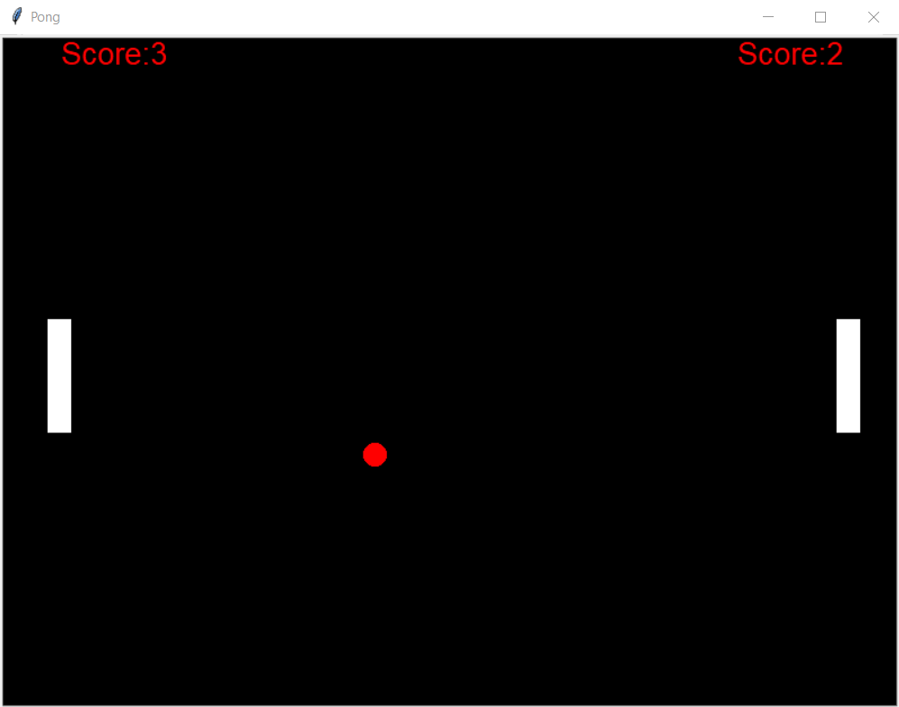

# Pong Game (Python)

A simple Python-based Pong game built to practice object-oriented programming and game logic.

## Concepts Used
- Object-Oriented Programming (classes and inheritance)
- Event handling (keyboard input)
- Game loop and state management
- Collision detection
- Modular code structure

## Tools
- Python
- turtle module

## How to Run
```bash
python main.py


## Game Preview

